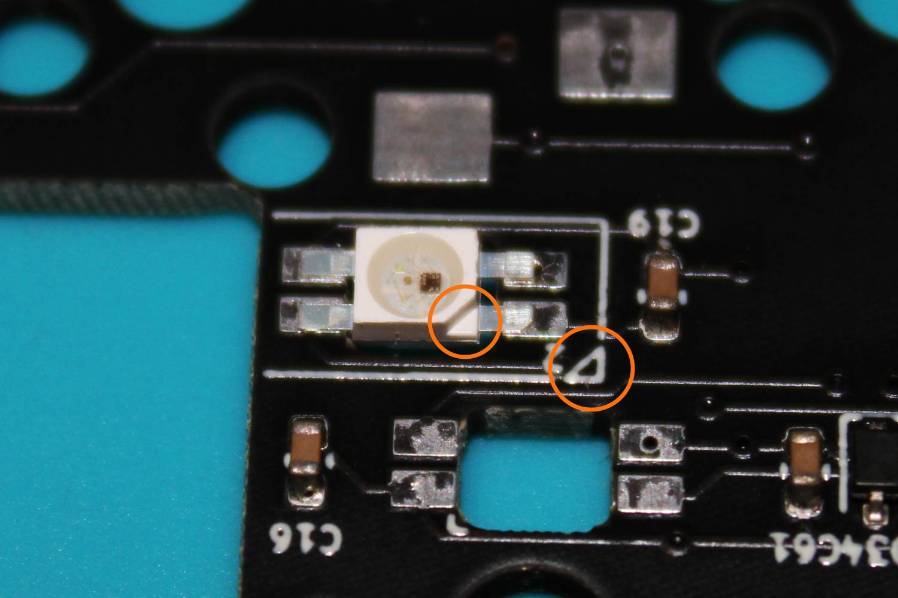
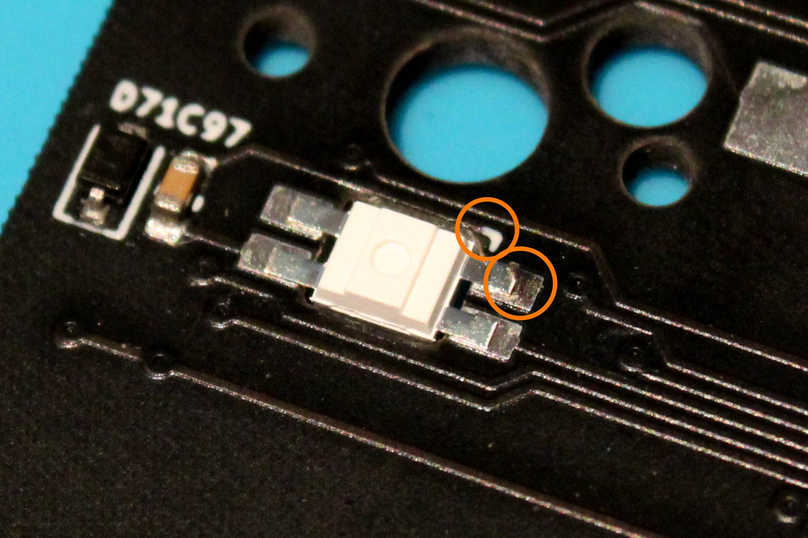
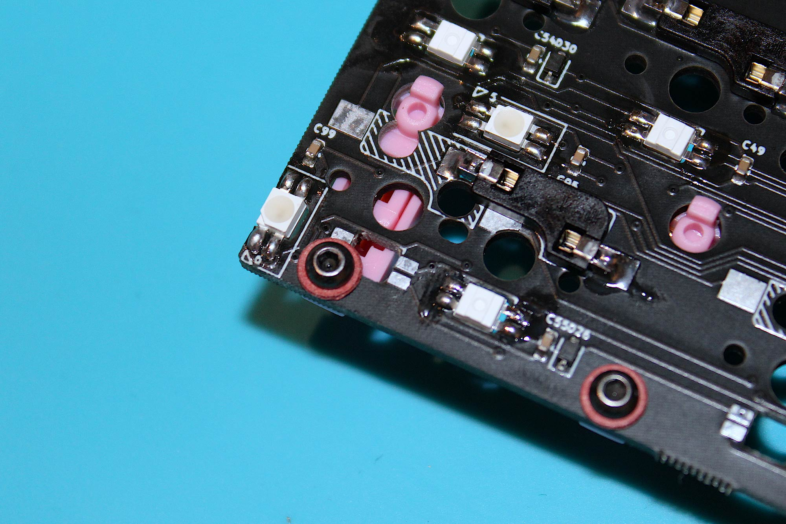

# UM-70 Assembly Guide

## **Content of UM-70 Kit**

**Housing** 
- 2 x Top Case
- 2 x Rear Cover
- 2 x Side Panel
- 1 x Rotary Encoder Knob

**RF4 Plate**
- 1 x Left
- 1 x Right

**1 x OLED Screen PCB**

**1 x OLED Screen**

**2 x 4 Pins Sockets**

**1 x 4 Pins Cable**

**1 x Encoder**

**100 x SK6812MINI RGB LED** (Only 84 are required, rest are spare)

**80 x Hot swap sockets** (Only 70/71 are required, rest are spare)

**2 x TRRS PJ-320A**

**20 x M2 3mm screws** (Only 18 are required, rest are spare)

**10 x M2 3mm Standoffs** (Only 9 are required, rest are spare)

**10 x M2 washers** (Only 9 are required, rest are spare)

**15 x M3 5mm screws** (Only 13 are required, rest are spare)

**10 x M3 14mm screws** (Only 8 are required, rest are spare)

**2 x M3 DIN562 Square Nuts** (It’s used as thread insert under the mounting points, these are for spare in case of the inserts came loose during shipping.)

**10 x Rubber feet** (Only 8 are required, rest are spare)

---

## **Test the PCBs before soldering**

All PCBs are tested prior shipping, but it’s good practice to make sure it’s working before soldering. It should be recognised as keyboard when it's connected, test it by shorting switch pins with tweezers. Don’t panic if the right side PCB outputted wrong keys, as the firmware is set to left as master.

## **Assembling the Main PCBs**

**_Blue = In-switch LEDs_**

**_Orange = Panel LEDs_**

There are 33 in-switch and 6 panel LEDs on the left half. 37 in-switch (38 for split backspace) and 6 panel LEDs on the right side.

## **Panel LEDs**

To solder side panel LEDs, the LED lens should be facing up. Align the marking on the PCB and the LED, repeat the same process to the rest.

## **In-switch LEDs**

To solder in-switch LEDs, the LED lens should be facing down. Align the markings on the PCB and the LED.

When soldering LEDs for spacekey on the left and Backspace on the right, solder one layout only.

## **Hot swap sockets**

Place sockets as shown in the photo. When soldering sockets for Spacekey and Backspace, only solder sockets to one layout only. Refer to the previous step for correct placement.

There are 4 sockets on the edge of the right half that need modification on the hot swap sockets.

Spread the right pin of the socket like it is shown the photo and then solder.

## **TRRS Jacks**

Place the jack on the back of the PCB and then solder.

## **OLED Screen Connector**

OLED screen connector is located on the left half.

Insert it on the back of the PCB and then solder.

## **Buzzer**
_Optional, AST1109MLTRQ buzzer is not included in the kit_

Buzzers are located at the front of the PCBs, only solder a buzzer on the master half (Left half by default. Note that this can be changed. Be sure to solder the buzzer to the half that will be plugged into your PC via USB-C).

- _Audio is not enabled by default._

- _QMK does not support speaker on the on slave half._

- _Audio feature takes large amount of memory, some other features may have to be disabled to allow space for it._

- _Buzzer is wired to IO pin B6._

AST1109MLRQ is non-polarity, solder anyway up.

---
## **Test the PCBs**

Connect both halves with TRRS cable **_first_**, and then connect USB cable to the **_left_** **_half_**.

**DO NOT PLUG/UNPLUG TRRS CABLE WHEN POWER IS ON (I.E. WHEN USB CABLE IS CONNECTED), IT WILL SHORT THE CONTROLLER.**

Check that all LEDs are working before proceeding to the next step.

### **Troubleshooting LEDs**

The LEDs are wired in series, see photos for the order.

If some of the LEDs do not light up or appear to be faulty, it’s most likely that something is wrong with the earliest LED in the series.
For example, if LED 24-39 doesn’t light up, check LED 24.
- Check solder joints

- Make sure there is a capacitor, it may have got knocked off during handling

- It’s not unusual to encounter a faulty RGB LED, replace it.

Once it’s tested, move on to the next step

---

## **Encoder**

Encoder it located on the right half.

Insert encoder to the front of the PCB, solder it from the underside of the PCB.

## **Stabilisers**

 

When installing screw-in stabiliser for Spacekey on the left half, use a washer/electrical tape to isolate the screw and the LED contacts to prevent shorting.

## **Mounting PCB to plate**

There are 4 mounting points on each half.

Secure the standoffs to the plate with washers and M2 screws.

Insert switches to plate and PCB. Switches should seat flush on the PCB. 

Secure PCB to plate with M2 screws. 

---
## **Test the PCBs**

Connect both halves with TRRS cable **_first_**, and then connect USB cable to the **_left_** **_half_**.

**DO NOT PLUG/UNPLUG TRRS CABLE WHEN POWER IS ON (I.E. WHEN USB CABLE IS CONNECTED), IT WILL SHORT THE CONTROLLER.**

Check all switches and encoder are working before proceeding to the next step.

### **Troubleshooting Encoder/Switches**

**Encoder**
- Check solder joints.
- Make sure there is a diode, it may have got knocked off during handling.

**Switches**
- Dismount the switch and check for bent pins, straighten the pins with pliers if necessary.
- Check hot swap socket solder joints.
- Check for diode on near the switch, it may have got knocked off during handling.

---

## **Soldering OLED screen PCB**

Note the front and back of the PCB

Insert the 4 pin connector to the back of the PCB. Align it with the marking on the PCB and then solder.

### **Be sure to solder correctly in this step, as there will be no access to the solder joints once the OLED screen is in place.**

Insert OLED screen headers to the front side for the PCB, solder each pin from the underside of the PCB.

Trim header pins short on both side.

Be sure the pins on the front are not protruding higher than the screen.

Attached the OLED screen to the left case with 2 M3 5mm screws.

## **Mount PCB assembly to case**

There are 5 mounting points on the left side and 6 mounting points on the right side.
Secure the PCB with the M3 5mm screws. There will be resistance at first, as the square nuts insets underneath are not yet aligned, it will become smooth after that.

## **Connecting OLED screen**

Connect OLED screen with the 4 pin cable.

## **Case Assembly**

Place side panel and cover onto the case, fasten them with M3 14mm screws. Stick the rubber feet on and it’s done!

---

---
